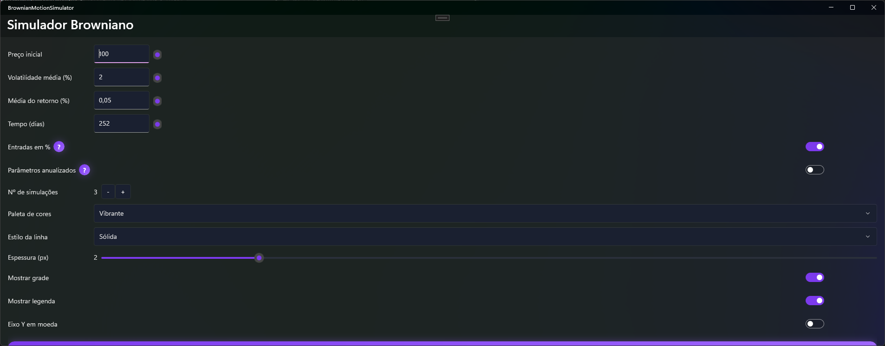
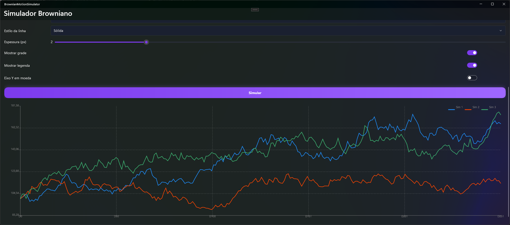

# BrownianMotionSimulator

Simulador interativo de **Movimento Browniano Geométrico (GBM)** construído em **.NET MAUI**, focado em visualização clara, personalização e responsividade. Ideal para explorar trajetórias de preços sob diferentes hipóteses de retorno e volatilidade.

---

## ✨ Funcionalidades

- **Simulação de GBM**: gere séries de preços com parâmetros ajustáveis (preço inicial, retorno médio e volatilidade).
- **Múltiplas trajetórias**: defina o **nº de simulações** e visualize várias linhas ao mesmo tempo.
- **Entradas em % e anualização**:
  - Interprete retorno/volatilidade como **percentuais** (ex.: 2 = 2%).
  - Converta parâmetros **anuais → diários** (assume 252 dias).
- **Gráfico completo**:
  - Eixos X/Y com **ticks** e **rótulos**, **grade** opcional e **legenda**.
  - Formatação do eixo Y como **moeda** (opcional).
- **Personalização visual**:
  - **Paletas** (vibrante, pastel, monocromáticas, arco-íris).
  - **Estilo de linha** (sólida, tracejada, pontilhada) e **espessura**.
- **Responsividade real**:
  - Layout de parâmetros em **2 colunas** (largas) ou **1 coluna** (estreitas), comutação automática.
- **Tema moderno (dark-first)**:
  - `Colors.xaml` e `Styles.xaml` para aparência consistente e elegante.

---

## 🖼️ Screenshots




---

## 🧩 Tecnologias

- **.NET 9** / **.NET MAUI**
- **CommunityToolkit.Mvvm** (propriedades/comandos gerados via source generators)
- **Microsoft.Maui.Graphics** (desenho customizado no `GraphicsView`)

---

## 🚀 Como executar

### Pré-requisitos
- SDK **.NET 9**
- Workload do **.NET MAUI** instalado
  ```bash
  dotnet workload install maui
  ```
---

## 🕹️ Uso

1. Ajuste **Preço inicial**, **Volatilidade**, **Média do retorno** e **Tempo (dias)**.
2. Ative **Entradas em %** se usar percentuais (ex.: 2 = 2%).
3. Marque **Parâmetros anualizados** para converter μ/σ anuais para passos diários (252).
4. Escolha **Nº de simulações**, **Paleta**, **Estilo** e **Espessura**.
5. Opcional: **Grade**, **Legenda** e **Eixo Y em moeda**.
6. Clique **Simular**.

---

## 🧱 Estrutura relevante

```
/Resources
  /Styles
    Colors.xaml        # Paleta dark (ColorPrimary, ColorBackground, etc.)
    Styles.xaml        # Estilos implícitos (Label, Button, Entry, GraphicsView...)

/View
  /Pages
    HomePage.xaml      # UI + troca responsiva (wide/narrow)
    HomePage.xaml.cs   # BindingContext, SizeChanged e Invalidate()

/ViewModel
  HomeViewModel.cs     # Lógica de simulação, opções visuais e comando Simulate

/View/Widgets/Helpers
  PriceSeriesDrawable.cs  # Drawable: eixos, grid, legenda, múltiplas séries
```

---

## ⚙️ Personalização rápida

- **Tema**: Ajuste cores em `Resources/Styles/Colors.xaml`.
- **Estilos**: Modifique componentes em `Resources/Styles/Styles.xaml`.
- **Linha do gráfico**: Altere `StrokeSize`, `LineStyle` e paletas no `HomeViewModel`.

---

